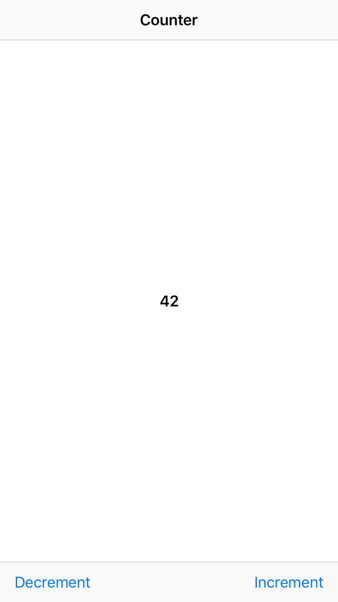
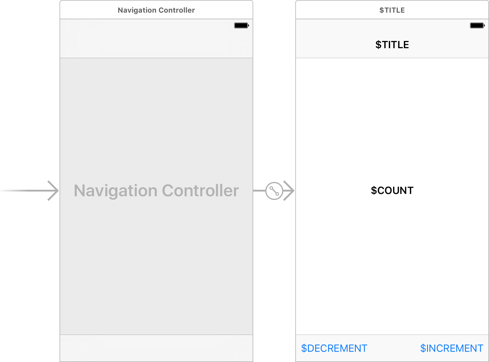

# Elm

This is [Elm](http://elm-lang.org) architecture for [Swift](https://swift.org).

# Interface

```swift
public protocol Module {

    associatedtype Message
    associatedtype Model: Initable
    associatedtype Command
    associatedtype View

    static func update(for message: Message, model: inout Model) -> [Command]
    static func view(for model: Model) -> View

}
```

# Example

Let's build a counter:



## Functional core

* Module:
    ```swift
    struct Counter: Module {

        enum Message {
            case userDidTapIncrementButton
            case userDidTapDecrementButton
        }

        struct Model: Initable {
            var count = 0
        }

        struct View {
            let title = "Counter"
            let count: String
            let incrementButton = Button(
                title: "Increment",
                callback: .userDidTapIncrementButton
            )
            let decrementButton = Button(
                title: "Decrement",
                callback: .userDidTapDecrementButton
            )
            struct Button {
                let title: String
                let callback: Message
            }
        }

        enum Command {}

        static func update(for message: Message, model: inout Model) -> [Command] {
            switch message {
            case .userDidTapIncrementButton:
                model.count += 1
            case .userDidTapDecrementButton:
                model.count -= 1
            }
            return []
        }

        static func view(for model: Model) -> View {
            let count = String(model.count)
            return View(count: count)
        }
        
    }
    ```

* Program:
    ```swift
    let counter = Counter.makeProgram()
    ```

## Imperative shell

* Storyboard:
    

* View controller:
    ```swift
    class CounterViewController: UIViewController, Subscriber {

        typealias View = Counter.View
        typealias Command = Counter.Command

        @IBOutlet var countLabel: UILabel?

        @IBOutlet var incrementButton: UIBarButtonItem?
        @IBOutlet var decrementButton: UIBarButtonItem?

        override func viewDidLoad() {
            super.viewDidLoad()
            counter.subscribe(self)
        }

        func update(presenting view: View) {
            title = view.title
            countLabel?.text = view.count
            incrementButton?.title = view.incrementButton.title
            decrementButton?.title = view.decrementButton.title
        }

        func update(performing command: Command) {}

        @IBAction func userDidTapIncrementButton() {
            counter.dispatch(counter.view.incrementButton.callback)
        }

        @IBAction func userDidTapDecrementButton() {
            counter.dispatch(counter.view.decrementButton.callback)
        }

    }
    ```
